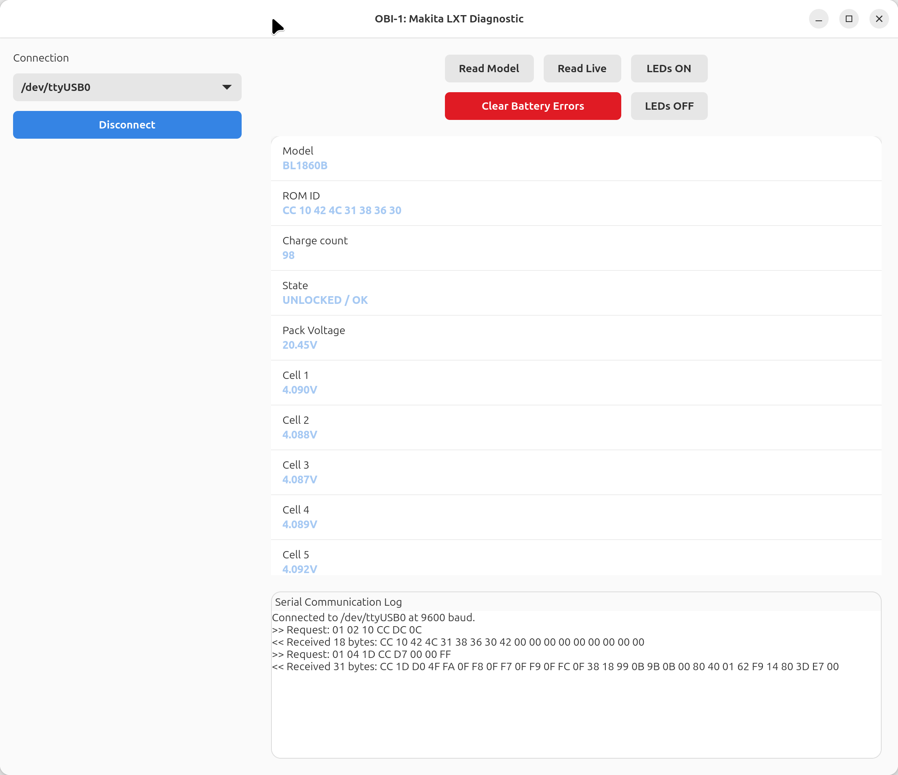

# OBI-1 Diagnostic (Flatpak Edition)

**OBI-1** is an advanced, Linux-optimized diagnostic tool for lithium-ion battery packs, primarily targeting Makita LXT systems. This version is anevolution of the original project, rebuilt for recent Linux environments with enhanced safety monitoring.



## ⚖️ License & Acknowledgments

* **Current License**: This software is licensed under the **GNU GPLv3**.
* **Origin**: This project is a specialized fork of **Open Battery Information** by **Martin Jansson**.
* **Compliance**: We retain the original MIT license notice for the foundation code while applying GPLv3 protections to all new modifications and the combined work.

## 🛠 Enhancements in this Fork

Unlike the original Python script approach, this version introduces:

* **Revised UI**: A complete rewrite using **GTK4 and Libadwaita** for a native GNOME/Linux look, featuring a centered HeaderBar with integrated window controls.
* **Automated Permissions**: A custom `setup-permissions.sh` script to handle serial port access without manual user group management.
* **Flatpak Distribution**: Fully sandboxed packaging for security and cross-distribution compatibility.
* **Visual Safety Alerts**: Real-time color coding for low-voltage cells (< 2.5V) and high-temperature warnings (≥ 60°C).

---

## 🚀 Installation (Linux)

### 1. Configure Hardware Access

By default, Linux restricts access to the serial ports used by your Arduino interface. Run the included setup script to apply the necessary udev rules:

```bash
chmod +x setup-permissions.sh
sudo ./setup-permissions.sh

```

*Note: You may need to unplug and replug your USB adapter after running this.*

### 2. Install the App

Download the `org.obi.diagnostic.flatpak` file from the [Releases](https://www.google.com/search?q=../../releases) section and run:

```bash
flatpak install --user org.obi.diagnostic.flatpak

```

### 3. Launch

Find **OBI-1 Diagnostic** in your application menu or launch via terminal:

```bash
flatpak run org.obi.diagnostic

```

---

## 💻 Development & Building

To modify the source or build the package manually, ensure you have `flatpak-builder` installed.

1. **Build and Install Locally**:
```bash
flatpak-builder --user --install --force-clean build-dir org.obi.diagnostic.json

```


2. **Create a Redistributable Bundle**:
```bash
flatpak-builder --repo=repo --force-clean build-dir org.obi.diagnostic.json
flatpak build-bundle ./repo org.obi.diagnostic.flatpak org.obi.diagnostic

```


---

## 🤝 Support & Contributions

This project aims to aid in battery repair and reduce waste by identifying false BMS triggers.

* For questions regarding the original logic, visit the [original repository](https://github.com/mnh-jansson/open-battery-information).
* To support the original author, consider [Buying them a coffee](https://www.buymeacoffee.com/mnhjansson).

---


